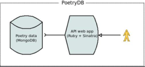
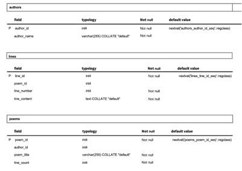

# Poetry-Data-Work
📖 [Python + PostgreSQL]: A functional data workflow covering all stages from extraction to visualization.

## Data Sourcing
### Introduction to the API used:

PoetryDB is a free API for accessing poetry data. It offers a large collection of poems, which can be searched by author, title, or lines, with results in JSON format. The API is built in Ruby using Sinatra for routes, and the data is stored in a MongoDB database.

 
Source: https://github.com/thundercomb/poetrydb

### Justification of my selection:
* PoetryDB has been consistently maintained by its creator and is open-source, so it is a reliable and stable API for research. 
* The database is extensive and accurate enough to support meaningful analysis. Specifically, it includes 129 authors, 3010 poems and 254053 lines data.

## Data Ingestion
### Data Flow
* Fetching and Inserting Authors:
     a.	Sending a request to retrieve a list of authors (get_authors()).
     b.	Storing these authors in the authors table using insert_authors().
 
 
* Fetching Titles:
   a.	Sending another request to get a list of poem titles (get_titles()).
   b.	For each title, fetching detailed information about the poem, including the author, title, line count, and the poem's content (get_poem_by_title()).
 
 
* Inserting Poems:
   a.	Inserting poems data into the poems table using insert_poem(). The corresponding author is fetched from the authors table to maintain the relationship between the poem and its author.
   b.	If a poem is already in the database, the script skips inserting it again.
 
 
* Inserting Poem Lines:
   a.	The lines of each poem are stored in the lines table using insert_lines(). Each line of the poem is linked to its corresponding poem_id, and each line is given a line number to preserve the order of the poem's content.

### Database Schema
 

Database Schema

Constraints:
 
Unique constraints on author_name, poem_title and line_id ensure that there are no duplicates in the database. Foreign keys like author_id and poem_id constraints ensure data integrity by linking poems to valid authors and lines to valid poems.

## Data Cleaning and Processing 
* Removing Duplicate Poems:
Used SQL with the poem_title unique constraint and ON CONFLICT DO NOTHING clause to filter out the duplicates, leaving 2727 unique poems in the database.

* Cleaning Poem Titles and Line Content:
Titles like 'Twould ease -- a Butterfly -- contains unnecessary quotes or symbols at the beginning or end. I used regular expressions in Python to clean these titles. For line content cleaning, I also removed extra spaces and meaningless symbols by using regular expressions. After the cleaning step, I removed 19 empty lines from the database.

## Exploratory Data Analysis and Insights
	Distribution of poem lengths:
 
Insights: Most of poems have 5-14 lines.
	Top 10 most productive authors:
 
Insights: Despite having 129 authors, the top 10 authors with the highest output account for more than half of the total number of poems (1534 out of 2727).
	Frequency of time-related words in poems:
 
Insights: The word 'may,' which can also mean 'might,' is the most frequent time-related word in the poems, followed by 'night.'

	Top 20 most frequent words (potential themes) across all poems:
 
Insights: Combined natural language toolkit (nltk) library and my own custom stopwords to remove many meaningless stopwords. The top three words in the ranking list that can be potential themes are “love”, “heart” and “god”.

## Visualization 
	Distribution of poem lengths [Pie Chart]
Pie chart visualized how various poem length ranges contribute to the overall dataset.
 
	Top 10 most productive authors [Horizontal Bar Chart]
Horizontal bar charts are excellent for comparing categories.
 
	Time-related words frequency [Treemap]
The size of each rectangle in a treemap corresponds to the frequency of the words. This makes it easy to compare the relative frequencies of different time-related words at a glance.
 
	Top 50 most common words [Word Cloud]
A word cloud visually emphasizes the most frequent words by displaying them in varying sizes.
 
	Correlation between poem length and word diversity [Scatter plot]
There is only one poem record that has more than 5000 lines, so to better analyze correlation between poem length and word diversity, I ignored this record.
 
Poem length and word diversity are two continuous variables. A scatter plot is ideal for clearly displaying the relationship between them.
 
